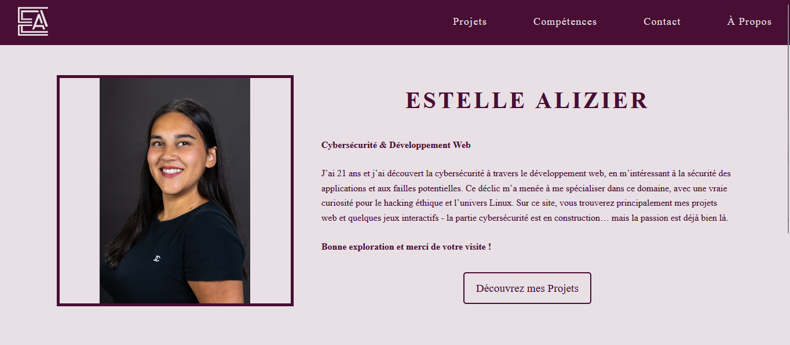

<body style="font-family: Arial, sans-serif; line-height: 1.6; background-color: #FFFFFF; color: #333333; padding: 20px; max-width: 800px; margin: auto;">

  <h1>🎨 Estelle Alizier - Portfolio</h1>

  

    Bienvenue sur le dépôt GitHub de mon <strong>site portfolio</strong>, une vitrine interactive qui présente mes projets, mes compétences, et ma passion pour le développement web et les jeux vidéo. 
    Accessible à cette adresse 👉 <a href="https://estelle-alizier.fr" target="_blank">estelle-alizier.fr</a>
  

  

  <h2>🚀 Objectif du site</h2>

  

    Ce site a pour but de <strong>mettre en avant mes réalisations</strong> de manière claire et visuellement soignée. C’est un point de départ pour toute personne souhaitant découvrir <strong>ce que je sais faire, comment je travaille</strong>, et <strong>ce qui me motive au quotidien</strong> dans le domaine du développement.
  

  

    Il s'agit d’un projet <strong>entièrement conçu et développé par moi</strong>, du design à l’intégration, en passant par l’ergonomie et le responsive design. Il reflète mon univers, mes valeurs, et mon souci du détail.
  

  

<h2>🛡️ Sécurité web & tests en conditions réelles</h2>

  En parallèle du développement, j’intègre une démarche de <strong>cybersécurité proactive</strong> dans mes projets. Mon portfolio a notamment servi de support pour :

<ul>
  <li>🧪 Tester des <strong>injections SQL</strong> sur des zones protégées, avec validation côté serveur</li>
  <li>🔍 Explorer les <strong>contrôles d’accès</strong> à certains répertoires sensibles (via tests directs et analyse réseau)</li>
  <li>🛠️ Manipuler et intercepter les requêtes HTTP via <strong>Burp Suite</strong> pour détecter d’éventuelles failles logiques</li>
  <li>📂 Vérifier les protections mises en place contre l’accès non autorisé à certains fichiers ou chemins critiques</li>
</ul>

  Ces tests me permettent de <strong>mieux comprendre les failles courantes</strong> 
  et d’<strong>améliorer la robustesse de mes projets</strong> dès la conception.

  <h2>🎮 Pourquoi des jeux ?</h2>

  

    Je conçois également des <strong>petits jeux codés par mes soins</strong>, que je mets en avant dans mon portfolio. 
    Pourquoi ? Parce que <strong>jouer permet de créer avec plaisir</strong>, tout en explorant la logique, les algorithmes, et l’architecture du code de façon concrète. Ces jeux sont pour moi un moyen d’<strong>apprendre en m’amusant</strong> et de démontrer ma capacité à construire des systèmes interactifs, organisés et fonctionnels.
  

  

  <h2>🤝 Pour les curieux ou recruteurs</h2>

  

    Ce projet a été pensé avec <strong>authenticité et transparence</strong>. 
    Chaque ligne de code, chaque fonctionnalité, chaque projet mis en avant a été réfléchi pour donner une <strong>vision sincère de mon profil</strong>. Si vous êtes recruteur·se, formateur·rice, ou tout simplement passionné·e de code, <strong>je serais ravie d’échanger !</strong>
  

  

    📬 Contact : dispo sur le site ou directement via <a href="https://www.linkedin.com/in/estelle-a-5b1208298" target="_blank">LinkedIn</a> 
    💡 Suggestions bienvenues en issues !
  

  

  <h2>🔐 À propos du code</h2>

  

    Le code source de ce site <strong>n’est pas inclus dans ce dépôt</strong>, pour des raisons de sécurité et de respect de la propriété intellectuelle. 
    Il s’agit d’un projet <strong>intégralement réalisé par moi</strong> : du design à l’ergonomie, en passant par le développement responsive et les jeux embarqués.
  

  

    💡 Une <strong>capture d’écran</strong> est fournie ci-dessous pour en illustrer le rendu visuel. 
    D’autres projets codés par mes soins sont accessibles sur mon GitHub si vous souhaitez explorer mon travail technique.
  

  

  <h2>🛠️ Stack technique</h2>

  <!-- LANGAGES -->
  <h3>💻 Langages de programmation</h3>
  

    
    
    
    
    
    
    
    
  

  <!-- FRAMEWORKS -->
  <h3>🧰 Frameworks et Logiciels</h3>
  

    
    
    
    
    
    
    
    
    
    
    
    
    
    
    
  

 

  <h2>🖼️ Aperçu du site</h2>

  
Voici un aperçu de mon site portfolio :

  

    
  

  
Capture d’écran de la page d’accueil du site https://estelle-alizier.fr 📸 

</body>
